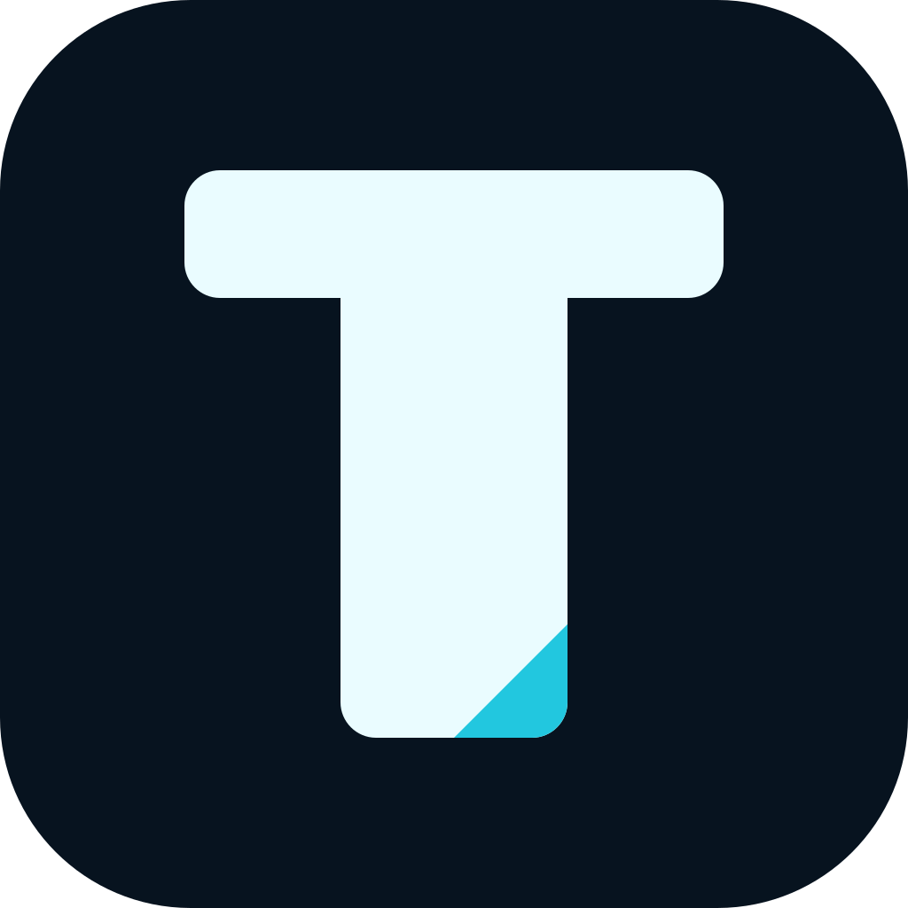
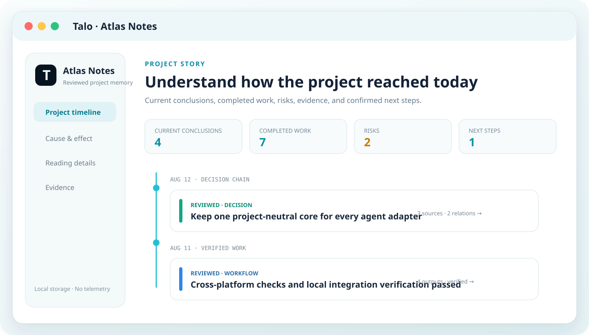
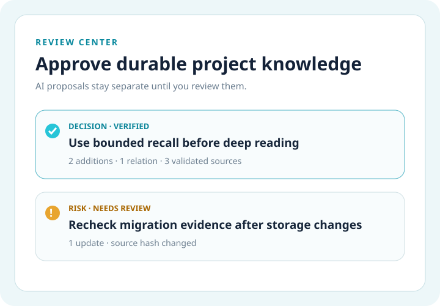
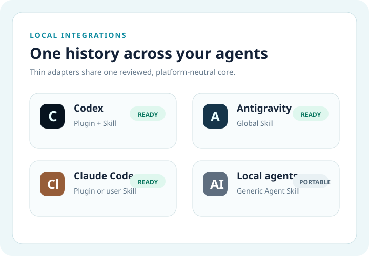

<p align="center">
  
</p>

<h1 align="center">Talo</h1>

<p align="center"><strong>Never start over.</strong></p>

<p align="center">
  Reviewed, traceable project memory shared by Codex, Claude Code, Antigravity,<br>
  and other local AI agents—private, offline, and token-aware.
</p>

<p align="center">
  <a href="https://wangxuezhi.github.io/codex-project-memory/">Website</a> ·
  <a href="README.zh-CN.md">简体中文</a> ·
  <a href="https://github.com/WangXueZhi/codex-project-memory/releases">Releases</a> ·
  <a href="docs/architecture.md">Architecture</a>
</p>

<p align="center">
  <a href="https://github.com/WangXueZhi/codex-project-memory/actions/workflows/ci.yml"></a>
  <a href="LICENSE"></a>
  
  
</p>



## What Talo changes

Every new AI task usually starts with the same tax: re-explain the architecture, rediscover prior
decisions, reopen evidence, and hope the next agent does not mix projects. Talo turns completed work
into one reviewed project history that every supported local agent can use.

| Without Talo | With Talo |
| --- | --- |
| Re-explain the project in every task | Recall only the knowledge relevant to the current goal |
| Conclusions lose their evidence | Keep reasons, actions, outputs, sources, and conclusions together |
| Memory is trapped in one AI product | Share one platform-neutral store through thin adapters |
| Old facts remain silently trusted | Revalidate every cited file, permission, and hash |
| Long histories consume the context window | Retrieve compact candidates first, then deep-read within budget |
| Memory files leak into repositories | Store private memory outside projects and Git history |

## Start in three steps

### 1. Build Talo

Node.js 22.13+ and pnpm 10.30.2 are required.

```bash
git clone https://github.com/WangXueZhi/codex-project-memory.git
cd codex-project-memory
pnpm install --frozen-lockfile
pnpm build
```

### 2. Install an integration

| Platform | Recommended path | What it installs |
| --- | --- | --- |
| **Codex** | Add this repository as a Codex marketplace, then install the plugin | Skill, CLI, reviewed proposal workflow, and minimum sandbox access |
| **Claude Code** | Use Talo Desktop or `talo integration install claude` | A local marketplace plugin or managed user Skill |
| **Antigravity** | Run `talo integration install antigravity` | A self-contained global Skill and managed activation rule |
| **Other local agents** | Download the generic Agent Skill from Releases | Skill, CLI, browser assets, and a rules snippet |

Codex marketplace installation:

```bash
codex plugin marketplace add WangXueZhi/codex-project-memory --ref main
codex plugin add codex-project-memory@codex-project-memory
```

### 3. Recall, work, and review

```bash
talo detect --path "$PWD"
talo recall --path "$PWD" --query "current task goal"
talo get --path "$PWD" --memory-ids ID,ID
talo story --path "$PWD"
```

At the end of substantial work, an agent proposes durable conclusions, workflows, risks, evidence,
and next steps. Nothing becomes formal memory until it passes review.

## One history, multiple views

<table>
  <tr>
    <td width="50%"></td>
    <td width="50%"></td>
  </tr>
</table>

- **Project timeline first.** Read what happened, why it happened, what evidence was used, what the
  work produced, and what comes next.
- **Cause and effect when needed.** Reviewed `observes`, `causes`, `supports`, `depends_on`, and
  related links preserve the path from finding to decision.
- **Unified review inbox.** Every platform may propose; formal memory is written only after review.
- **Direct access without AI.** Talo Desktop and the offline hub let you inspect every registered
  project without loading that history into an agent task.

## Token-aware recall

Talo does not dump an entire memory archive into the context window. Its default startup flow uses:

1. roughly **800 estimated tokens** for compact candidates;
2. explicit recommendations based on project scope, lexical relevance, freshness, confidence, and
   reviewed one-hop relations;
3. roughly **1700 estimated tokens** for selected deep reads.

These are deterministic planning estimates, not billing tokens and not a model tokenizer output.

## Private by construction

- Local Markdown, JSON, and single-file HTML only.
- No cloud sync, MCP server, SQLite database, embeddings, telemetry, or runtime network access.
- Strict project isolation; cross-project reads require an explicit one-way, read-only link.
- Common credentials, private keys, `.env` files, and sensitive paths are denied by default.
- Recall queries are not persisted in memory, proposals, or audit logs.
- Generated HTML uses a strict CSP and does not fetch external resources.

New installations use `~/.project-memory/v1`. A legacy-only installation may continue using
`~/.codex/project-memory/v1`; if both exist, Talo refuses to merge them silently.

```bash
talo home
talo home select --path ~/.project-memory/v1
talo migrate-home --from ~/.codex/project-memory/v1 --to ~/.project-memory/v1
```

## Talo Desktop

The Tauri desktop application provides a native review center, project hub, platform installation,
updates, migration, sandbox repair, and uninstall actions. It supports English and Simplified
Chinese, system/light/dark appearance, macOS, and 64-bit Windows 10/11.

```bash
pnpm desktop:dev
pnpm desktop:build
```

Release installers and portable Agent Skill archives are published on the
[GitHub Releases page](https://github.com/WangXueZhi/codex-project-memory/releases).

## Command map

```text
detect / register / status     identify and manage projects
recall / get / search / load   retrieve bounded project context
brief / story / guide          read current state and chronological work
relations / graph / path       trace reviewed cause and effect
propose / commit / reject      review durable memory changes
hub / open / shortcut          browse every registered project offline
integration / home             manage platforms and storage
```

Adapter Protocol v1 remains backward compatible with the original project-memory commands. Both
`talo` and `project-memory` launchers are included during the transition.

## Development

```bash
pnpm check
pnpm test:visual
```

- [Architecture](docs/architecture.md)
- [Submission and review notes](docs/submission.md)
- [Security](SECURITY.md)
- [Privacy](PRIVACY.md)
- [Support](SUPPORT.md)
- [Changelog](CHANGELOG.md)

## License

Apache-2.0
