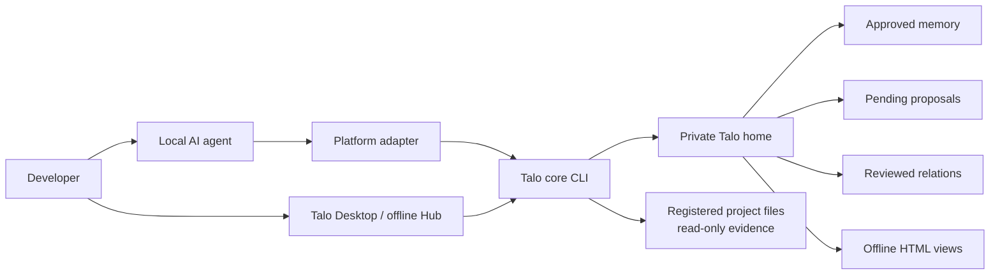
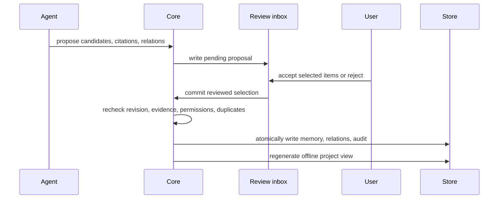

# Talo Architecture

English | [简体中文](architecture.zh-CN.md)

Talo is a local-first project-memory system for AI-assisted software work. It keeps one reviewed,
traceable history outside the repository and makes that history available to Codex, Claude Code,
Antigravity, and other local agents through thin platform adapters.

The architecture is intentionally simple: one core, one private store, one review model, and
multiple adapters. There is no hosted Talo service and no runtime dependency on a database, MCP
server, embedding provider, analytics service, or CDN.

## System Context



The project repository contains the product source and generated adapter bundles. A user's memory
store is never placed in this repository.

## Architectural Layers

| Layer | Responsibility | Canonical location |
| --- | --- | --- |
| Product surfaces | Desktop app, offline Hub, CLI output, public website | `apps/desktop`, `site` |
| Platform adapters | Start the same workflow from each supported agent | `plugins`, `adapters` |
| Universal Skill | Defines recall, review, evidence, and handoff behavior | `skills/project-memory` |
| Core domain | Identity, storage, retrieval, review, relations, security, HTML | `packages/project-memory-core` |
| Private state | Registry, approved memory, proposals, audit, generated views | `~/.project-memory/v1` |

Only the core reads or writes Talo storage. Adapters package and invoke the core; they do not
implement separate memory semantics.

## Repository Map

```text
Talo/
├── packages/project-memory-core/   platform-neutral domain and CLI
├── plugins/codex-project-memory/   Codex plugin compatibility package
├── skills/project-memory/          canonical cross-agent Skill
├── adapters/
│   ├── claude-code/                Claude Code integration bundle
│   ├── antigravity/                Antigravity integration bundle
│   └── generic/                    portable local-agent bundle
├── apps/desktop/                   Tauri desktop application
├── site/                           dependency-free GitHub Pages site
├── scripts/                        build, validation, reinstall, release packaging
└── .github/workflows/              CI, Pages, and tagged Release automation
```

Generated adapter binaries are committed deliberately. CI rebuilds them and verifies that the
controlled output matches the source.

## Core Domain Model

### Project identity

Talo starts from a normalized real path. For Git projects it also records the common Git directory,
remote URL, and observed commit. These signals help recognize worktrees and moved projects, but
Talo never silently merges two registrations. Relinking requires explicit approval.

### Memory and evidence

An approved memory is a durable project fact: a decision, architecture rule, workflow, convention,
risk, or meaningful status. It can include a summary, topic, reviewed role, event narrative,
validated outputs, and up to twelve citations.

Citations point to current-project files or explicitly authorized linked-project files. Talo stores
the source commit and SHA-256 hash and revalidates them when memory is read. Changed, missing, or no
longer authorized evidence is reported as stale rather than silently trusted.

### Proposals and review

Agents do not write formal memory directly.



Pending proposals are not memory and do not appear as formal graph nodes.

### Relations and work history

Reviewed relations preserve cause and context between memories. Supported meanings include
`observes`, `causes`, `depends_on`, `supports`, `supersedes`, `derived_from`, `contradicts`, and
`related_to`. Event chains retain the path from task or observation, to finding, to resulting
decision or implementation.

The default reading surface is a project brief and chronological work history. The graph is a
secondary traceability view, not the primary data model.

## Retrieval Architecture

Talo reads the approved Markdown and relation files directly; it does not maintain embeddings or a
persistent search index.

The default substantial-task startup is:

1. `detect` resolves the current project without registering it silently.
2. `recall` ranks compact candidates within roughly 800 estimated tokens.
3. The agent passes only recommended IDs to `get`.
4. `get` returns complete selected memories within roughly 1700 estimated tokens.

Ranking is deterministic and considers project scope, lexical relevance, freshness, confidence,
and reviewed one-hop relations. Token figures are model-independent planning estimates, not billing
tokens.

## Storage and Isolation

New installations use `~/.project-memory/v1` by default. A sole legacy
`~/.codex/project-memory/v1` remains usable in place; if both homes exist, selection is explicit.

```text
~/.project-memory/v1/
├── registry.json
├── links.json
├── integrations/
└── projects/<project-id>/
    ├── project.json
    ├── MEMORY.md
    ├── RELATIONS.json
    ├── audit.jsonl
    ├── proposals/
    └── views/
```

Writes use a project lock, revision checks, a private temporary file, and atomic replacement.
POSIX-capable systems use `0700` directories and `0600` state files.

A directional link from project B to project A grants B read-only access to allowed memory and text
files from A. It does not grant reverse access. All file reads are normalized, constrained to the
authorized root, checked against deny rules, and protected against symbolic-link escape.

## Platform Integrations

### Codex

The Codex plugin provides the Skill, CLI, review hook, and browser assets. The Desktop installer or
`integration repair codex` adds only the active Talo home to Codex writable roots and installs a
stable, narrowly permissioned launcher for managed-sandbox cases.

### Claude Code and Antigravity

Both integrations install generated self-contained Skills that call the same core CLI. Installation
is user-level and explicit. Registering a project never writes `AGENTS.md`, `GEMINI.md`, or other
activation files into that project.

### Generic local agents

The portable Agent Skill contains the universal Skill, the built CLI, offline browser assets, and a
small rules snippet. Pure web products without local file and process access can consume only an
explicitly exported brief or story, not the live store.

## Desktop and Offline Views

Talo Desktop is a Tauri shell around local core commands. It manages integrations, lists projects,
reviews proposals, and opens the global Hub. The embedded Node sidecar runs the same built CLI used
by the adapters.

Project and global views are generated as self-contained HTML. Preact, Cytoscape, layouts, CSS, and
icons are bundled at build time. A restrictive CSP permits only the generated inline assets; the
view does not call a server or CDN.

## Public Website and Release Architecture

The public website in `site/` is separate from the private Hub. GitHub Pages serves static product
information only; it cannot access or host user memory.

Tagged releases use `.github/workflows/release.yml`:

1. verify that tag `vX.Y.Z` matches `package.json`;
2. build portable and Codex integration archives on Linux;
3. build the macOS application and Windows NSIS installer on native runners;
4. generate per-platform manifests and SHA-256 files;
5. attach all artifacts to one GitHub Release.

Release artifacts use the public Talo brand, for example `talo-agent-skill-0.14.1.zip`. Internal
identifiers remain compatible where renaming would break existing installations.

## Compatibility Boundary

The public product and repository are named **Talo**. The following identifiers intentionally remain
for compatibility:

- Codex plugin and marketplace ID: `codex-project-memory`
- universal Skill directory and frontmatter name: `project-memory`
- legacy CLI alias: `project-memory`
- core package and Desktop binary identifiers: `project-memory-*`
- memory environment variables and existing storage paths

New user-facing copy should say Talo. Compatibility identifiers should change only through an
explicit migration with tests, upgrade logic, and release notes.

## Security Invariants

- No runtime network request is required for memory operations.
- No project is registered, relinked, or cross-linked silently.
- No proposal becomes formal memory without a review outcome.
- No cited file is trusted after its hash or authorization changes.
- No adapter owns a separate store or modifies storage independently.
- No private memory is committed to a registered repository by default.
- Destructive, migration, and integration-management commands remain separately approval-gated.

## Non-goals

Talo does not provide cloud sync, multi-user collaboration, hosted accounts, encryption at rest,
semantic embeddings, automatic background extraction, autonomous Git modification, or a web-hosted
copy of the private memory store.
