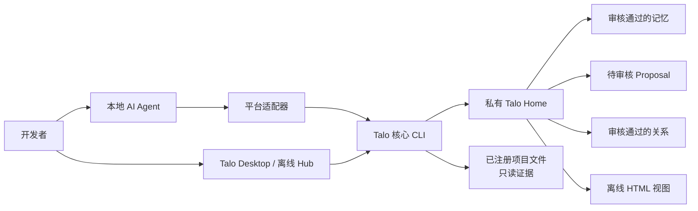
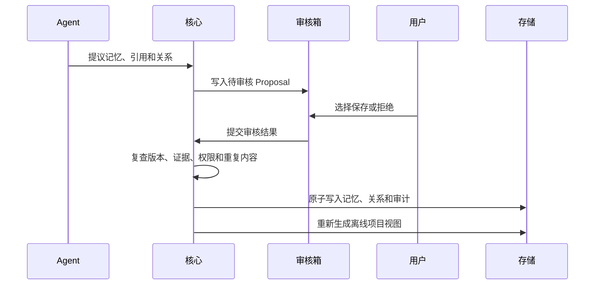

# Talo 架构说明

[English](architecture.md) | 简体中文

Talo 是一个面向 AI 辅助软件工作的本地优先项目记忆系统。它把一份经过审核、可追溯的项目
历史保存在仓库之外，并通过薄适配器让 Codex、Claude Code、Antigravity 和其他本地 Agent
使用同一份记忆。

整体架构刻意保持简单：一个核心、一份私有存储、一套审核模型、多个平台适配器。Talo 不提供
托管服务，记忆功能在运行时也不依赖数据库、MCP Server、embedding 服务、分析脚本或 CDN。

## 系统上下文



项目仓库只保存产品源码和受控生成的适配器产物。用户的真实记忆数据不会放进本仓库。

## 架构分层

| 层级 | 职责 | 权威位置 |
| --- | --- | --- |
| 产品界面 | Desktop、离线 Hub、CLI 输出、公开官网 | `apps/desktop`、`site` |
| 平台适配器 | 从不同 Agent 启动同一套工作流 | `plugins`、`adapters` |
| 通用 Skill | 定义召回、审核、证据和交接行为 | `skills/project-memory` |
| 核心领域 | 身份、存储、召回、审核、关系、安全、HTML | `packages/project-memory-core` |
| 私有状态 | 注册表、正式记忆、Proposal、审计、离线视图 | `~/.project-memory/v1` |

只有核心层可以读写 Talo 存储。适配器只负责打包和调用核心，不各自实现不同的记忆语义。

## 仓库结构

```text
Talo/
├── packages/project-memory-core/   平台无关领域逻辑与 CLI
├── plugins/codex-project-memory/   Codex 插件兼容包
├── skills/project-memory/          跨 Agent 的权威 Skill
├── adapters/
│   ├── claude-code/                Claude Code 集成包
│   ├── antigravity/                Antigravity 集成包
│   └── generic/                    通用本地 Agent 包
├── apps/desktop/                   Tauri 桌面应用
├── site/                           无构建依赖的 GitHub Pages 官网
├── scripts/                        构建、校验、重装、发布打包
└── .github/workflows/              CI、Pages 与 Tag Release 自动化
```

适配器中的构建产物会受控提交。CI 会重新构建并检查产物与源码一致。

## 核心领域模型

### 项目标识

Talo 从规范化后的真实路径开始识别项目。对于 Git 项目，还会记录公共 Git 目录、远程地址和
观测到的提交。这些信息用于识别 worktree 和移动后的项目，但不会静默合并两个注册记录；重新
绑定必须得到明确批准。

### 记忆与证据

审核通过的记忆是可长期复用的项目事实，例如决策、架构规则、流程、约定、风险或重要状态。
记忆可以包含摘要、主题、审核角色、事件过程、已验证产出和最多十二条引用。

引用只能指向当前项目文件，或已明确授权的关联项目文件。Talo 保存来源提交与 SHA-256 哈希，
读取时重新校验。来源变化、丢失或权限失效时会标记为过期，而不是继续静默信任。

### Proposal 与审核

Agent 不能直接写入正式记忆。



待审核 Proposal 不是正式记忆，也不会提前成为图谱节点。

### 关系与工作历史

审核通过的关系保存记忆之间的原因和上下文，包括 `observes`、`causes`、`depends_on`、
`supports`、`supersedes`、`derived_from`、`contradicts` 和 `related_to`。事件链可以保留
“任务或观察 → 发现 → 决策或实现”的完整路径。

默认阅读界面是项目交接和按时间排列的工作历史。图谱是二级追溯视图，不是主要数据模型。

## 召回架构

Talo 直接读取审核后的 Markdown 与关系文件，不使用 embedding，也不维护持久化搜索索引。

重要任务的默认启动流程是：

1. `detect` 识别当前项目，不静默注册；
2. `recall` 在约 800 个估算 token 内返回紧凑候选；
3. Agent 只把推荐 ID 传给 `get`；
4. `get` 在约 1700 个估算 token 内返回完整的已选记忆。

排序是确定性的，会考虑项目范围、文本相关度、新鲜度、置信度和一层审核关系。这里的 token 是
与模型无关的上下文规划估算，不是账单 token。

## 存储与隔离

新安装默认使用 `~/.project-memory/v1`。如果只存在旧目录
`~/.codex/project-memory/v1`，可以继续原地使用；两个 Home 同时存在时必须显式选择。

```text
~/.project-memory/v1/
├── registry.json
├── links.json
├── integrations/
└── projects/<project-id>/
    ├── project.json
    ├── MEMORY.md
    ├── RELATIONS.json
    ├── audit.jsonl
    ├── proposals/
    └── views/
```

写入使用项目锁、revision 校验、私有临时文件和原子替换。支持 POSIX 权限的系统使用 `0700`
目录与 `0600` 状态文件。

项目 B 指向项目 A 的单向链接，只允许 B 读取 A 中允许的记忆和文本文件，不包含反向权限。
所有文件读取都会规范化路径、限制在授权根目录内、检查拒绝规则，并防止符号链接逃逸。

## 平台集成

### Codex

Codex 插件提供 Skill、CLI、审核 Hook 和浏览器资源。Desktop 安装器或
`integration repair codex` 只会把当前 Talo Home 加入 Codex 可写目录，并为托管沙箱场景
安装稳定且权限范围受限的 launcher。

### Claude Code 与 Antigravity

两者都安装由构建流程生成的自包含 Skill，并调用同一个核心 CLI。安装是用户级、显式操作。
注册项目不会向项目目录写入 `AGENTS.md`、`GEMINI.md` 或其他激活文件。

### 通用本地 Agent

通用 Agent Skill 包含权威 Skill、已构建 CLI、离线浏览器资源和简短规则片段。没有本地文件与
进程权限的纯网页 AI 只能读取显式导出的 brief 或 story，不能访问实时记忆库。

## Desktop 与离线视图

Talo Desktop 是调用本地核心命令的 Tauri 外壳，用于管理集成、查看项目、审核 Proposal 和
打开全局 Hub。内置 Node sidecar 运行的就是各适配器使用的同一份构建后 CLI。

项目视图与全局视图均生成为自包含 HTML。Preact、Cytoscape、布局算法、CSS 和图标都在构建
时打包；严格 CSP 只允许生成的内嵌资源，页面不访问服务器或 CDN。

## 官网与正式发布架构

`site/` 中的公开官网与私有 Hub 完全分离。GitHub Pages 只托管静态产品介绍，不能访问或托管
用户记忆。

Tag Release 使用 `.github/workflows/release.yml`：

1. 校验 `vX.Y.Z` Tag 与 `package.json` 版本一致；
2. 在 Linux 构建通用 Agent Skill 和 Codex 插件包；
3. 在原生 runner 构建 macOS 应用和 Windows NSIS 安装包；
4. 生成各平台 manifest 与 SHA-256 文件；
5. 把全部产物上传到同一个 GitHub Release。

发布文件使用 Talo 品牌，例如 `talo-agent-skill-0.14.1.zip`。会影响已有安装的内部标识继续作为
兼容层保留。

## 兼容边界

对外产品和仓库名称是 **Talo**。以下标识为兼容已有安装而保留：

- Codex 插件与 marketplace ID：`codex-project-memory`
- 通用 Skill 目录与 frontmatter 名称：`project-memory`
- 旧 CLI 别名：`project-memory`
- 核心 package 与 Desktop 二进制标识：`project-memory-*`
- 现有记忆环境变量和存储路径

新增用户可见文案应使用 Talo。只有在具备迁移逻辑、升级测试和 Release Note 时，才可以修改
兼容标识。

## 安全不变量

- 记忆操作不需要运行时网络请求。
- 不静默注册、重新绑定或跨项目授权。
- 没有审核结果的 Proposal 不会成为正式记忆。
- 来源哈希或权限变化后，不继续信任旧引用。
- 适配器不拥有独立存储，也不绕过核心修改数据。
- 默认不会把私有记忆提交到已注册仓库。
- 删除、迁移和集成管理命令继续独立要求批准。

## 非目标

Talo 不提供云同步、多人协作、托管账号、静态加密、语义 embedding、后台自动抽取、自动 Git
修改，也不会把私有记忆库托管到网页上。
